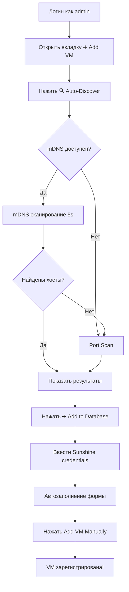
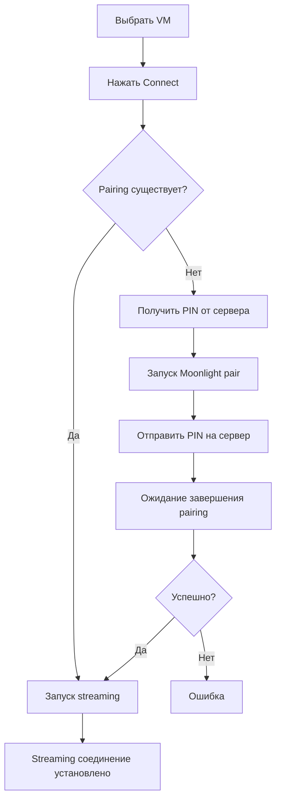

# 📘 admin_sunshine.py - Подробная документация

## Обзор

**admin_sunshine.py** - это объединённое административное приложение для управления Eclypse системой. Оно совмещает функциональность двух отдельных приложений:
- `eclypse_en.py` - основной клиент с админ-панелью
- `add_vm_gui_en.py` - инструмент автоматического обнаружения Sunshine хостов

**Размер:** ~1,670 строк кода  
**Язык:** Python 3.8+  
**GUI Framework:** CustomTkinter (современный dark theme)  
**Роли пользователей:** Admin, Master (обычные users видят упрощённый интерфейс)

---

## 🎯 Основные возможности

### 1. Управление пользователями
- ✅ Создание новых пользователей (admin/master/user)
- ✅ Просмотр списка всех пользователей
- ✅ Удаление пользователей
- ✅ Назначение ролей

### 2. Управление виртуальными машинами (VM)
- ✅ Просмотр всех зарегистрированных VM
- ✅ **Автоматическое обнаружение** Sunshine хостов в сети
- ✅ Ручное добавление VM
- ✅ Удаление VM
- ✅ Обновление списка

### 3. Назначение VM пользователям
- ✅ Привязка VM к пользователям
- ✅ Просмотр всех назначений
- ✅ Удаление назначений
- ✅ Один VM → несколько пользователей

### 4. Подключение к VM (Moonlight)
- ✅ Автоматическая проверка статуса pairing
- ✅ Автоматический pairing с PIN-кодом
- ✅ Запуск streaming (1920x1080, 60 FPS)
- ✅ Подключение для admin и обычных users

### 5. 🆕 Auto-Discovery функции
- ✅ **mDNS обнаружение** (_nvstream._tcp.local.)
- ✅ **Port scanning** (47989, 47984, 47990)
- ✅ **Multi-subnet поддержка** (настраиваемые подсети)
- ✅ **VPN-friendly** (увеличенный timeout 2s)
- ✅ **Credentials dialog** (ввод Sunshine user/password)
- ✅ **Автозаполнение формы** после обнаружения

---

## 🏗️ Архитектура кода

### Структура файла

```python
# 1. ИМПОРТЫ (строки 1-20)
import customtkinter as ctk
from tkinter import ttk, messagebox, scrolledtext
import requests, subprocess, threading, time
import socket, concurrent.futures, ipaddress
from zeroconf import ServiceBrowser, Zeroconf  # Опционально

# 2. КОНСТАНТЫ (строки 25-37)
DEFAULT_API_URL = "https://n8nua.pp.ua"
MOONLIGHT_EXEC = "C:/moonlight/Moonlight.exe"
CONFIG_FILE = "client_config.txt"
SUBNETS_CONFIG_FILE = "subnets.conf"
SUNSHINE_HTTPS_PORT = 47989
SUNSHINE_HTTP_PORT = 47984
SUNSHINE_ALT_PORT = 47990

# 3. КЛАСС SunshineListener (строки 39-77)
# mDNS listener для обнаружения Sunshine сервисов

# 4. КЛАСС EclypseApp (строки 78-1667)
# Основное приложение со всеми методами
```

### Диаграмма классов

```
┌─────────────────────────────────────────────┐
│         SunshineListener                    │
├─────────────────────────────────────────────┤
│ + discovered_hosts: list                    │
│ + lock: threading.Lock                      │
├─────────────────────────────────────────────┤
│ + add_service()                             │
│ + remove_service()                          │
│ + update_service()                          │
└─────────────────────────────────────────────┘

┌─────────────────────────────────────────────┐
│            EclypseApp                       │
├─────────────────────────────────────────────┤
│ Properties:                                 │
│ - root: CTk                                 │
│ - token: str                                │
│ - headers: dict                             │
│ - current_user: str                         │
│ - user_role: str                            │
│ - api_url: str                              │
│ - verify_ssl: bool                          │
├─────────────────────────────────────────────┤
│ Authentication:                             │
│ + authenticate()                            │
│ + _load_api_url()                           │
│ + _save_api_url()                           │
├─────────────────────────────────────────────┤
│ UI Setup:                                   │
│ + setup_login_frame()                       │
│ + setup_admin_interface()                   │
│ + setup_user_interface()                    │
│ + setup_users_tab()                         │
│ + setup_vms_tab()                           │
│ + setup_assign_tab()                        │
│ + setup_connect_tab()                       │
│ + setup_add_vm_tab()          ← НОВАЯ!     │
├─────────────────────────────────────────────┤
│ CRUD Operations:                            │
│ + create_user()                             │
│ + delete_user()                             │
│ + load_users()                              │
│ + load_vms()                                │
│ + delete_vm()                               │
│ + add_vm_manual()             ← НОВАЯ!     │
│ + assign_vm_to_user()                       │
│ + unassign_vm()                             │
│ + load_assignments()                        │
├─────────────────────────────────────────────┤
│ VM Connection:                              │
│ + connect_to_vm()                           │
│ + check_pairing_status()                    │
│ + pairing_process()                         │
├─────────────────────────────────────────────┤
│ Auto-Discovery:               ← НОВЫЕ!     │
│ + scan_network()                            │
│ + _perform_scan()                           │
│ + _port_scan_network()                      │
│ + _check_sunshine_port()                    │
│ + _create_host_card()                       │
│ + _quick_add_host()                         │
├─────────────────────────────────────────────┤
│ Configuration:                ← НОВЫЕ!     │
│ + load_subnets_config()                     │
│ + _create_default_subnet_config()           │
│ + open_subnet_config()                      │
├─────────────────────────────────────────────┤
│ Utility:                                    │
│ + log()                                     │
│ + toggle_ssl_verification()                 │
│ + show_ssl_warning()                        │
└─────────────────────────────────────────────┘
```

---

## 📱 Пользовательский интерфейс

### Экран входа

```
┌──────────────────────────────────────────┐
│     Eclypse Admin - Unified Console     │
├──────────────────────────────────────────┤
│                                          │
│          Eclypse Login                   │
│                                          │
│   Username: [________________]           │
│   Password: [________________]           │
│                                          │
│   ☐ Verify SSL certificates             │
│   ☐ Show API URL field                  │
│                                          │
│         [      Login      ]              │
│                                          │
│  ⚠️ SSL verification is disabled         │
│     This may pose a security risk        │
└──────────────────────────────────────────┘
```

### Админская панель (после входа)

```
┌────────────────────────────────────────────────────────────┐
│  Eclypse Admin - Unified Management Console               │
├────────────────────────────────────────────────────────────┤
│                                                            │
│  ┌──────────────────────────────────────────────────────┐ │
│  │ Users │ Virtual Machines │ Assignment │ VM Connection│ │
│  │                    │ ➕ Add VM │                       │ │
│  └──────────────────────────────────────────────────────┘ │
│                                                            │
│  [Содержимое активной вкладки]                            │
│                                                            │
│                                                            │
├────────────────────────────────────────────────────────────┤
│  [LOG AREA - Scrollable]                                  │
│  [22:15:30] Application started.                          │
│  [22:15:30] Current API URL: https://n8nua.pp.ua         │
│  [22:15:45] Login attempt for admin...                    │
│  [22:15:46] Login successful for admin (role: admin)      │
└────────────────────────────────────────────────────────────┘
```

### Вкладка "➕ Add VM" (новая!)

```
┌─────────────────────────────────────────────┐
│         Add Virtual Machine                 │
├─────────────────────────────────────────────┤
│                                             │
│  Hostname:                                  │
│  [_____________________________________]    │
│                                             │
│  IP Address:                                │
│  [_____________________________________]    │
│                                             │
│  Sunshine User:                             │
│  [_____________________________________]    │
│                                             │
│  Sunshine Password:                         │
│  [•••••••••••••••••••••••••••••••••••]    │
│                                             │
│  ┌──────────────────────────────────────┐  │
│  │  🔍 Auto-Discover Sunshine Hosts     │  │
│  └──────────────────────────────────────┘  │
│                                             │
│       ┌──────────────────────────┐          │
│       │ ⚙️ Configure Subnets     │          │
│       └──────────────────────────┘          │
│                                             │
│              ─── OR ───                     │
│                                             │
│       ┌──────────────────────┐              │
│       │  Add VM Manually     │              │
│       └──────────────────────┘              │
└─────────────────────────────────────────────┘
```

### Диалог Auto-Discovery

```
┌────────────────────────────────────────────────────┐
│           🔍 Discovering Sunshine Hosts            │
├────────────────────────────────────────────────────┤
│                                                    │
│  Status: Scanning 254 hosts in 2 subnet(s)...     │
│  [████████████████████░░░░░░░░░░] 73%             │
│                                                    │
│  Discovered Hosts:                                 │
│  ┌──────────────────────────────────────────────┐ │
│  │ ┌──────────────────────────────────────────┐ │ │
│  │ │ 🖥️  DESKTOP-9TLBH3                       │ │ │
│  │ │ 📍 IP: 192.168.1.124 | Port: 47990       │ │ │
│  │ │        Method: Port Scan (192.168.1.0/24)│ │ │
│  │ │                     [➕ Add to Database]  │ │ │
│  │ └──────────────────────────────────────────┘ │ │
│  │                                              │ │
│  │ ┌──────────────────────────────────────────┐ │ │
│  │ │ 🖥️  GamePC                               │ │ │
│  │ │ 📍 IP: 192.168.116.8 | Port: 47989       │ │ │
│  │ │        Method: mDNS                       │ │ │
│  │ │                     [➕ Add to Database]  │ │ │
│  │ └──────────────────────────────────────────┘ │ │
│  └──────────────────────────────────────────────┘ │
│                                                    │
│                   [  Close  ]                      │
└────────────────────────────────────────────────────┘
```

### Credentials Dialog

```
┌────────────────────────────────────┐
│  🔐 Sunshine Credentials           │
├────────────────────────────────────┤
│                                    │
│  Host: DESKTOP-9TLBH3              │
│  IP: 192.168.1.124                 │
│                                    │
│  Enter Sunshine login credentials: │
│                                    │
│  Sunshine Username:                │
│  [admin___________________]        │
│                                    │
│  Sunshine Password:                │
│  [••••••••••••••••••••••••]        │
│                                    │
│      [  OK  ]    [ Cancel ]        │
└────────────────────────────────────┘
```

---

## 🔄 Рабочий процесс

### Сценарий 1: Добавление VM через Auto-Discovery



### Сценарий 2: Подключение к VM



---

## 🔌 API Endpoints (используемые)

### Authentication
- `POST /auth/token` - Получить JWT токен
- `POST /auth/register` - Создать пользователя

### Users Management
- `GET /admin/users` - Список всех пользователей
- `DELETE /admin/user/{id}` - Удалить пользователя

### VM Management
- `GET /vm/list` - Список всех VM
- `POST /vm/register` - Зарегистрировать новую VM
- `DELETE /vm/delete/{id}` - Удалить VM

### Assignments
- `GET /vm/assignments` - Список всех назначений
- `POST /vm/assign` - Назначить VM пользователю
- `DELETE /vm/unassign` - Отменить назначение

### Pairing
- `POST /vm/prepare-pairing` - Получить PIN-код
- `POST /vm/complete-pairing` - Подтвердить pairing

---

## 🛠️ Ключевые методы

### Метод: `scan_network()`

**Назначение:** Запускает сканирование сети для поиска Sunshine хостов

**Алгоритм:**
1. Создаёт UI окно сканирования
2. Загружает подсети из конфига
3. Запускает `_perform_scan()` в фоновом потоке
4. Обновляет UI через `root.after()`

**Используется:**
- При нажатии "🔍 Auto-Discover Sunshine Hosts"

---

### Метод: `_perform_scan(scan_window)`

**Назначение:** Выполняет двухфазное обнаружение

**Фаза 1 - mDNS (если доступно):**
```python
zeroconf = Zeroconf()
listener = SunshineListener()
browser = ServiceBrowser(zeroconf, "_nvstream._tcp.local.", listener)
time.sleep(5)  # Ждём 5 секунд
discovered = listener.discovered_hosts.copy()
```

**Фаза 2 - Port Scan (если мало результатов):**
```python
for each subnet in configured_subnets:
    for each host in subnet.hosts():
        check ports 47989, 47984, 47990
        if port open:
            add to discovered
```

**Возвращает:** Список обнаруженных хостов

---

### Метод: `_quick_add_host(host)`

**Назначение:** Показывает диалог ввода credentials и автозаполняет форму

**Шаги:**
1. Создаёт окно `CTkToplevel`
2. Поля username/password
3. Validation на пустые поля
4. При OK:
   - Автозаполнение hostname
   - Автозаполнение IP
   - Автозаполнение user
   - Автозаполнение password
   - Переключение на вкладку "➕ Add VM"
5. При Cancel - закрытие без действий

---

### Метод: `load_subnets_config()`

**Назначение:** Загружает список подсетей из файла конфигурации

**Логика:**
1. Проверяет существование `subnets.conf`
2. Если нет - создаёт с локальной подсетью
3. Читает построчно, валидирует CIDR
4. Пропускает комментарии (#) и пустые строки
5. Fallback на автоопределение локальной сети

**Формат файла:**
```
# Комментарий
192.168.1.0/24
10.0.0.0/24
```

---

## ⚙️ Конфигурационные файлы

### 1. `client_config.txt`

**Назначение:** Сохранение API URL

**Формат:**
```
https://n8nua.pp.ua
```

**Создание:** Автоматически при первом входе

---

### 2. `subnets.conf`

**Назначение:** Список подсетей для сканирования

**Формат:**
```
# Subnet Configuration File for Sunshine Discovery
# Add one subnet per line in CIDR notation
# Lines starting with # are comments
# Example: 192.168.1.0/24

# Auto-detected local network
192.168.1.0/24

# Add your additional subnets below:
# 192.168.2.0/24
# 10.0.0.0/24
```

**Создание:** Автоматически при первом сканировании

**Редактирование:** Через UI (⚙️ Configure Subnets) или вручную

---

## 🔐 Безопасность

### SSL Verification
- По умолчанию **отключена** (`verify_ssl = False`)
- Можно включить через чекбокс при логине
- Показывает предупреждение о рисках

### JWT Token
- Хранится в памяти приложения
- Используется в header `Authorization: Bearer {token}`
- Содержит `username`, `role`, `exp`

### Роли пользователей
- **admin** - полный доступ ко всем функциям
- **master** - полный доступ ко всем функциям  
- **user** - только просмотр назначенных VM и подключение

---

## 📊 Логирование

### Формат лога
```
[HH:MM:SS] Сообщение
```

### Типы сообщений
- **Информационные:** обычный текст
- **Успешные:** зелёный цвет (в будущем)
- **Ошибки:** красный цвет (в будущем)

### Примеры:
```
[19:45:12] Application started.
[19:45:12] Current API URL: https://n8nua.pp.ua
[19:45:20] Login attempt for admin...
[19:45:21] Login successful for admin (role: admin)
[19:45:30] Starting network scan for Sunshine hosts...
[19:45:31] Loaded 2 subnet(s) from config
[19:45:36] mDNS discovery found 1 host(s)
[19:45:40] Port scan found 2 additional host(s)
[19:45:45] Auto-filled form with host: 192.168.1.124 and credentials
[19:45:50] VM 'DESKTOP-9TLBH3' successfully added (ID: 15).
```

---

## 🐛 Отладка

### Включение verbose логирования

**Добавьте в начало методов:**
```python
print(f"DEBUG: {variable_name} = {variable_value}")
```

### Проверка сетевого подключения
```python
import socket
socket.gethostname()  # Ваше имя хоста
socket.gethostbyname(socket.gethostname())  # Ваш IP
```

### Проверка портов Sunshine
```powershell
Test-NetConnection -ComputerName 192.168.1.124 -Port 47989
Test-NetConnection -ComputerName 192.168.1.124 -Port 47990
```

---

## 📈 Производительность

### Сканирование сети
- **mDNS:** ~5 секунд
- **Port scan 254 хоста:** ~30-60 секунд
- **Port scan 2 подсети (508 хостов):** ~60-120 секунд

### Оптимизации
- ✅ Параллельное сканирование (100 потоков)
- ✅ Timeout 2.0s (баланс скорость/надёжность)
- ✅ Прогресс-бар обновляется каждые 10 хостов
- ✅ UI не замораживается (фоновые потоки)

---

## 🔄 Обновления и миграция

### От eclypse_en.py к admin_sunshine.py

**Что изменилось:**
- ✅ Добавлена вкладка "➕ Add VM"
- ✅ Все старые функции работают как раньше
- ✅ Размер окна увеличен (800x600 → 900x700)
- ✅ Название изменено на "Unified Management Console"

**Совместимость:**
- ✅ API эндпоинты те же
- ✅ База данных та же
- ✅ Конфигурационные файлы совместимы

### От add_vm_gui_en.py к admin_sunshine.py

**Что изменилось:**
- ✅ Интегрировано в админскую панель
- ✅ Не отдельное приложение, а вкладка
- ✅ Все функции auto-discovery сохранены

---

## 📚 Дополнительные ресурсы

### Документация зависимостей
- [CustomTkinter](https://github.com/TomSchimansky/CustomTkinter)
- [Zeroconf](https://python-zeroconf.readthedocs.io/)
- [Requests](https://requests.readthedocs.io/)
- [PyJWT](https://pyjwt.readthedocs.io/)

### Связанные файлы
- `eclypse_en.py` - оригинальный клиент
- `add_vm_gui_en.py` - оригинальный auto-discovery tool
- `server/main.py` - FastAPI backend

---

## 🎯 Roadmap / Будущие улучшения

### Планируется:
- [ ] Экспорт/импорт конфигурации
- [ ] История подключений
- [ ] Группировка VM по категориям
- [ ] Поиск/фильтрация в таблицах
- [ ] Статистика использования
- [ ] Темы оформления (light/dark/custom)
- [ ] Мульти-язычность
- [ ] Обновление приложения из UI

---

**Версия документа:** 1.0  
**Дата создания:** 2025-11-27  
**Автор:** AI Assistant
